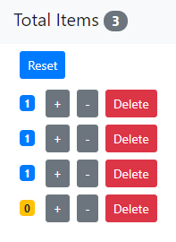

# Shopping-Cart-App

A simple shopping cart App using React.

## Current Features and UI

    

## Local Development
### Requirements
 - [Node](https://nodejs.org/en/download/current/)

# Install the dependencies needed
npm install

# Start the app
In the project directory, you can run:
### `npm start

Runs the app in the development mode. 
Open [http://localhost:3000](http://localhost:3000) to view it in the browser.
